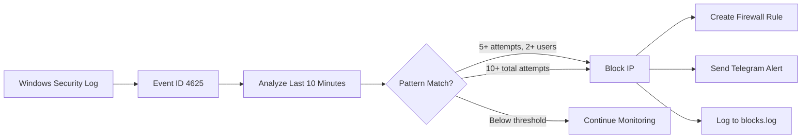
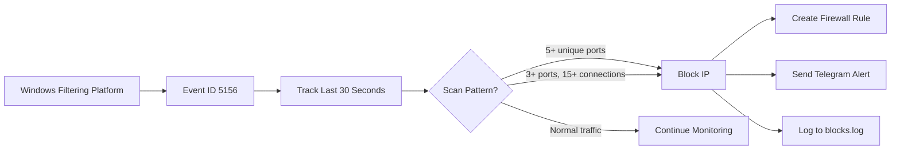

<div align="center">

# 🛡️ ReconBlock

### Advanced Reconnaissance and Brute Force Protection
*Enterprise-Grade Security Automation for Windows Servers*

[](https://github.com/yourusername/reconblock)
[](https://github.com/PowerShell/PowerShell)
[](https://www.microsoft.com/windows)
[](LICENSE)

**Automatically detect and block malicious attacks in real-time with instant Telegram notifications**

[Features](#-features) • [Installation](#-installation) • [Quick Start](#-quick-commands) • [Documentation](#-usage) • [Telegram Setup](#-telegram-setup)

</div>

---

## 🎯 Overview

ReconBlock is a **production-ready PowerShell security tool** that provides enterprise-grade protection against brute force attacks and port scanning reconnaissance. It monitors Windows Security Event Logs, automatically blocks malicious IPs via Windows Firewall, and sends instant alerts through Telegram.

### Why ReconBlock?

<table>
<tr>
<td width="33%" align="center">

<h3>🔒 Zero-Config Security</h3>
<p>Install once, protect forever. Automatic detection and blocking with smart whitelisting.</p>
</td>
<td width="33%" align="center">

<h3>📱 Real-Time Alerts</h3>
<p>Instant Telegram notifications for every attack with detailed threat analysis.</p>
</td>
<td width="33%" align="center">

<h3>⚡ Native Windows</h3>
<p>Pure PowerShell solution using native Windows Firewall and Event Logs.</p>
</td>
</tr>
</table>

---

## ✨ Features

### Core Protection

| Feature | Description | Details |
|---------|-------------|---------|
| 🔒 **Brute Force Protection** | Automatic RDP attack detection | Blocks on **5+ attempts with 2+ usernames** OR **10+ total attempts** (10 min window) |
| 🔍 **Reconnaissance Detection** | Port scanning identification | Blocks on **5+ unique ports** OR **3+ ports with 15+ connections** (30 sec window) |
| ⚡ **Real-Time Blocking** | Instant IP blocking | Dual firewall rules (inbound + outbound) via Windows Firewall |
| 📱 **Telegram Alerts** | Push notifications | Attack type, IP, port, attempts, and timestamps |

### Advanced Features

- **📊 Security Dashboard** - Generate beautiful HTML reports with cybersecurity theme
- **🔄 Auto Log Rotation** - Keeps logs under 5000 lines automatically
- **⏰ Scheduled Monitoring** - Runs every 5 minutes via Windows Task Scheduler
- **🎯 Smart Whitelisting** - Auto-detects and whitelists localhost, private IPs, and your public IP
- **💼 Enterprise-Ready** - Production-grade with comprehensive error handling
- **🚀 Easy Management** - Simple `rb` command-line interface

---

## 📋 Requirements

```yaml
OS:          Windows Server 2016+ / Windows 10/11
PowerShell:  Version 5.1 or higher
Privileges:  Administrator access required
Firewall:    Windows Defender Firewall enabled
```

---

## 📦 Installation

### Quick Install (Recommended)

```powershell
# 1. Download and extract ReconBlock
# 2. Right-click PowerShell → Run as Administrator
# 3. Navigate to the ReconBlock folder
cd C:\Users\YourName\Desktop\ReconBlock

# 4. Run the installer
.\ReconBlock_v1.0.ps1

# 5. Follow the interactive prompts
#    - Confirm installation (Y/N)
#    - Enter Telegram Bot Token (optional)
#    - Enter Telegram Chat ID (optional)
```

### Installation Directory Structure

```
C:\ReconBlock\
├── 📁 Config\
│   ├── telegram.json      → Telegram bot configuration
│   └── whitelist.txt      → Manual IP whitelist
├── 📁 Logs\
│   ├── detection.log      → Detection engine logs
│   └── blocks.log         → Blocked IPs history
├── 📁 Reports\
│   └── Security_Report_*.html  → Generated security reports
├── 📁 Scripts\
│   ├── Detect.ps1         → Detection engine (runs every 5 min)
│   └── Manage.ps1         → Management console
```

> **✅ Installation Complete!** ReconBlock is now protecting your system 24/7

---

## ⚡ Quick Commands

After installation, restart PowerShell and use the **`rb`** shortcut for easy management:

<table>
<tr>
<td width="50%">

```powershell
# View all blocked IPs
rb view

# Show recent attack logs
rb logs

# Unblock a specific IP
rb unblock

# View system statistics
rb stats
```

</td>
<td width="50%">

```powershell
# Check protection status
rb status

# Generate HTML security report
rb report

# View whitelisted IPs
rb whitelist

# Configure Telegram bot
rb telegram-bot
```

</td>
</tr>
</table>

> 💡 **Tip:** The `rb` command works from any directory. If unavailable after install, restart PowerShell or run: `. $PROFILE`

---

## 🎯 Usage

### Management Console

Access the full management console with detailed parameters:

```powershell
cd C:\ReconBlock
.\Manage.ps1 -Action <command>
```

### Available Commands

<table>
<thead>
<tr>
<th width="20%">Command</th>
<th width="40%">Description</th>
<th width="40%">Example</th>
</tr>
</thead>
<tbody>
<tr>
<td><code>view</code></td>
<td>Display all blocked IPs by category</td>
<td><code>rb view</code></td>
</tr>
<tr>
<td><code>logs</code></td>
<td>Show recent block events (last 20)</td>
<td><code>rb logs</code></td>
</tr>
<tr>
<td><code>unblock</code></td>
<td>Unblock a specific IP address</td>
<td><code>rb unblock</code> → Enter IP</td>
</tr>
<tr>
<td><code>stats</code></td>
<td>System statistics and task info</td>
<td><code>rb stats</code></td>
</tr>
<tr>
<td><code>status</code></td>
<td>Check protection status</td>
<td><code>rb status</code></td>
</tr>
<tr>
<td><code>report</code></td>
<td>Generate HTML security report</td>
<td><code>rb report</code></td>
</tr>
<tr>
<td><code>whitelist</code></td>
<td>View and manage whitelisted IPs</td>
<td><code>rb whitelist</code></td>
</tr>
<tr>
<td><code>telegram-bot</code></td>
<td>Configure Telegram bot settings</td>
<td><code>rb telegram-bot</code></td>
</tr>
</tbody>
</table>

---

## 📱 Telegram Setup

Enable instant attack notifications through Telegram in 3 easy steps:

### Step 1: Create Your Bot

1. Open Telegram and search for **[@BotFather](https://t.me/BotFather)**
2. Send `/newbot` command
3. Follow the prompts to name your bot
4. **Copy your Bot Token** (looks like: `123456789:ABCdefGHIjklMNOpqrsTUVwxyz`)

### Step 2: Get Your Chat ID

1. Search for **[@userinfobot](https://t.me/userinfobot)** or **[@get_id_bot](https://t.me/get_id_bot)**
2. Send `/start` command
3. **Copy your Chat ID** (looks like: `987654321`)

### Step 3: Configure ReconBlock

**Option A: During Installation**
- Enter Bot Token and Chat ID when prompted

**Option B: Manual Configuration**
```powershell
# Create/edit telegram.json
notepad C:\ReconBlock\Config\telegram.json

# Add your credentials:
{
  "BotToken": "YOUR_BOT_TOKEN_HERE",
  "ChatID": "YOUR_CHAT_ID_HERE"
}
```

**Option C: Using rb command**
```powershell
rb telegram-bot
# Follow the interactive prompts
```

### Test Your Setup

Send `/start` to your bot. You should receive a welcome message:

```
🛡️ ReconBlock Security Bot Activated

✓ Your ReconBlock protection is now ACTIVE

📋 You will receive alerts for:
   • Brute Force Attacks
   • Reconnaissance Scans
   • Blocked IPs

⚡️ Protection Status: Running every 5 minutes
```

---

## 🔧 Configuration

### Manual Whitelist

Prevent legitimate IPs from being blocked:

```powershell
# Edit whitelist file
notepad C:\ReconBlock\Config\whitelist.txt

# Add one IP per line:
203.0.113.10
198.51.100.25
192.0.2.100
```

> **Auto-Whitelisted:** localhost (127.0.0.1), private IPs (10.x.x.x, 192.168.x.x, 172.16-31.x.x), and your public IP

### Adjust Detection Thresholds

Customize sensitivity by editing the detection script:

```powershell
# Open detection script
notepad C:\ReconBlock\Detect.ps1

# Modify configuration (lines 64-73)
$Config = @{
    BruteForceThreshold = 5    # Failed logins before blocking
    ReconThreshold = 10        # Port scans before blocking
    TimeWindow = 10            # Analysis window (minutes)
    MaxLogLines = 5000         # Max log file size
}
```

| Parameter | Default | Description |
|-----------|---------|-------------|
| `BruteForceThreshold` | 5 | Failed login attempts before blocking |
| `ReconThreshold` | 10 | Port scan threshold |
| `TimeWindow` | 10 | Time window for analysis (minutes) |
| `MaxLogLines` | 5000 | Maximum log file size before rotation |

### Change Detection Interval

Modify how often ReconBlock scans for attacks:

```powershell
# Open Task Scheduler
taskschd.msc

# Navigate to: Task Scheduler Library → ReconBlock-Detection
# Right-click → Properties → Triggers → Edit
# Change interval (default: 5 minutes)
```

---

## 📊 Security Reports

Generate comprehensive HTML security reports with attack analysis:

```powershell
rb report
```

### Report Includes:

- 🔴 **Brute Force Attempts** - Failed login attempts grouped by IP with timestamps
- 🟣 **Reconnaissance Scans** - Port scanning activities and patterns
- 🚫 **Blocked IPs** - Complete firewall block list with attack details
- 📈 **Attack Timeline** - Chronological visualization of threats
- 📊 **Statistics** - Attack counts, top attackers, and trends

Reports are saved to: `C:\ReconBlock\Reports\Security_Report_YYYY-MM-DD_HHMM.html`

---

## 🔍 How It Works

### Brute Force Detection Engine



**Triggers:**
- ✅ **5+ failed logins** on **2+ different usernames** (credential stuffing)
- ✅ **10+ total failed logins** from same IP (brute force)
- ⏰ Analysis window: **10 minutes**

### Reconnaissance Detection Engine



**Triggers:**
- ✅ **5+ unique ports** accessed (port scanning)
- ✅ **3+ ports** with **15+ total connections** (aggressive scanning)
- ⏰ Analysis window: **30 seconds**

### Blocking Mechanism

1. **Firewall Rule Creation:**
   - Inbound rule: `ReconBlock_[Type]_[IP]`
   - Outbound rule: `ReconBlock_[Type]_[IP]_Out`

2. **Rule Properties:**
   - Action: **Block**
   - Profile: **All** (Domain, Private, Public)
   - Persistent: **Yes** (survives reboots)

3. **Logging:**
   - Written to `blocks.log` with timestamp
   - Includes: IP, attack type, port, attempt count

---

## 🛠️ Troubleshooting

### Protection Not Working?

<details>
<summary><b>Check Task Status</b></summary>

```powershell
rb status
# Should show: "RUNNING"

# If stopped, check task manually:
Get-ScheduledTask -TaskName "ReconBlock-Detection" | Format-List *
```
</details>

<details>
<summary><b>View Detection Logs</b></summary>

```powershell
# Last 50 log entries
Get-Content C:\ReconBlock\Logs\detection.log -Tail 50

# Real-time monitoring
Get-Content C:\ReconBlock\Logs\detection.log -Wait -Tail 10
```
</details>

<details>
<summary><b>Manually Run Detection</b></summary>

```powershell
# Test detection engine directly
C:\ReconBlock\Detect.ps1

# Check for any errors
```
</details>

### Telegram Alerts Not Sending?

<details>
<summary><b>Verify Configuration</b></summary>

```powershell
# Check telegram.json exists
Get-Content C:\ReconBlock\Config\telegram.json

# Validate JSON format
Get-Content C:\ReconBlock\Config\telegram.json | ConvertFrom-Json
```
</details>

<details>
<summary><b>Test Bot Manually</b></summary>

```powershell
$token = "YOUR_BOT_TOKEN"
$chatId = "YOUR_CHAT_ID"
$uri = "https://api.telegram.org/bot$token/sendMessage?chat_id=$chatId&text=Test"
Invoke-RestMethod -Uri $uri
```
</details>

<details>
<summary><b>Check Internet Connectivity</b></summary>

```powershell
Test-NetConnection -ComputerName api.telegram.org -Port 443
# Should show: TcpTestSucceeded : True
```
</details>

### False Positives?

**Quick Fix:** Add legitimate IPs to whitelist
```powershell
# Add to whitelist
Add-Content C:\ReconBlock\Config\whitelist.txt "192.168.1.100"

# Or unblock immediately
rb unblock
# Enter IP: 192.168.1.100
```

**Adjust Thresholds:** Modify detection sensitivity (see [Configuration](#-configuration))

---

## 📈 Performance

<table>
<tr>
<td align="center" width="25%">
<h3>⚡ Detection Speed</h3>
<h2>~2-5s</h2>
<p>Per scan cycle</p>
</td>
<td align="center" width="25%">
<h3>💾 Memory Usage</h3>
<h2>&lt;50 MB</h2>
<p>Minimal footprint</p>
</td>
<td align="center" width="25%">
<h3>🖥️ CPU Impact</h3>
<h2>&lt;1%</h2>
<p>During scans</p>
</td>
<td align="center" width="25%">
<h3>📝 Log Size</h3>
<h2>5000 lines</h2>
<p>Auto-rotated</p>
</td>
</tr>
</table>

**Optimizations:**
- ✅ Compiled regex patterns for faster IP matching
- ✅ Hashtable-based grouping instead of `Group-Object`
- ✅ Cached public IP to avoid repeated API calls
- ✅ Efficient event filtering with time-based queries

---

## 📝 Changelog

### v1.0 (Current Release)

```diff
+ Initial production release
+ Brute force detection (Event ID 4625)
+ Reconnaissance detection (Event ID 5156)
+ Telegram integration with formatted alerts
+ Automatic log rotation (5000 line limit)
+ HTML security report generation
+ Smart IP whitelisting (localhost, private IPs, public IP)
+ Easy management console with 'rb' command
+ Scheduled monitoring every 5 minutes
```

---

## 🤝 Contributing

Contributions are welcome! Here's how you can help:

1. **🐛 Report Bugs** - [Open an issue](https://github.com/yourusername/reconblock/issues)
2. **💡 Suggest Features** - Share your ideas
3. **🔧 Submit PRs** - Fork, code, and submit pull requests

### Development Setup

```bash
# 1. Fork the repository
# 2. Create a feature branch
git checkout -b feature/amazing-feature

# 3. Make your changes
# 4. Test thoroughly on Windows Server
# 5. Commit your changes
git commit -m "Add amazing feature"

# 6. Push to your fork
git push origin feature/amazing-feature

# 7. Open a Pull Request
```

---

## ⚠️ Disclaimer

This tool is provided **"as is"** without warranty of any kind. Use at your own risk. 

- ✅ Always test in a **non-production environment** first
- ✅ Review firewall rules regularly
- ✅ Backup your configuration before updates
- ⚠️ Author is not responsible for any damages or security issues

---

## 📄 License

**MIT License** - see [LICENSE](LICENSE) file for details

```
Copyright (c) 2026 Harshit Sharma

Permission is hereby granted, free of charge, to any person obtaining a copy
of this software and associated documentation files...
```

---

## 👤 Author

<div align="center">

**Harshit Sharma**

[](https://github.com/yourusername)
[](https://t.me/yourtelegram)
[](mailto:your.email@example.com)

</div>

---

## 🌟 Support This Project

If ReconBlock helped protect your server, consider:

- ⭐ **Star this repository** on GitHub
- 🐛 **Report bugs** or issues you encounter
- 💡 **Suggest features** for future releases
- 📢 **Share** with other Windows Server admins
- ☕ **Buy me a coffee** (if you're feeling generous!)

---

## 📚 Additional Resources

- 📖 [Windows Event IDs Reference](https://docs.microsoft.com/en-us/windows/security/threat-protection/auditing/event-4625)
- 💻 [PowerShell Documentation](https://docs.microsoft.com/en-us/powershell/)
- 🤖 [Telegram Bot API](https://core.telegram.org/bots/api)
- 🔥 [Windows Firewall Rules](https://docs.microsoft.com/en-us/windows/security/threat-protection/windows-firewall/)
- 🛡️ [Windows Security Event Logging](https://docs.microsoft.com/en-us/windows/security/threat-protection/auditing/security-auditing-overview)

---

<div align="center">

### Made with ❤️ for Windows Server Security

**ReconBlock v1.0** | Protecting servers since 2026

[⬆ Back to Top](#️-reconblock)

</div>
